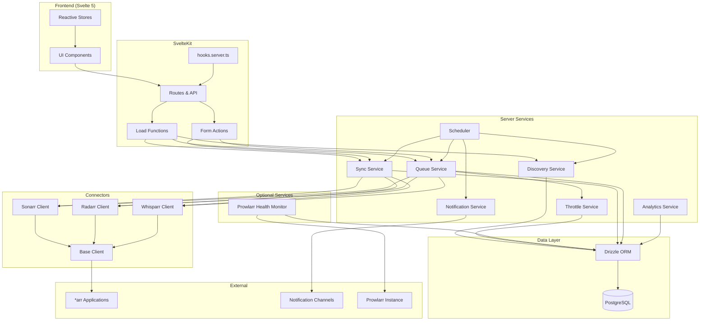
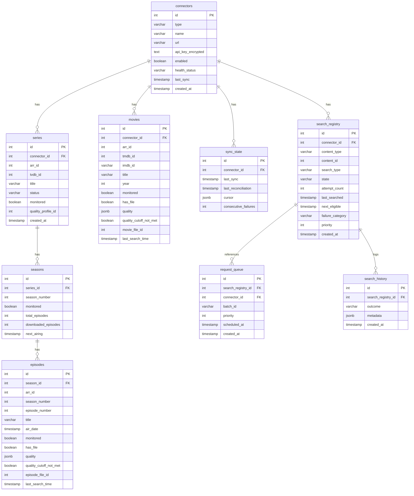
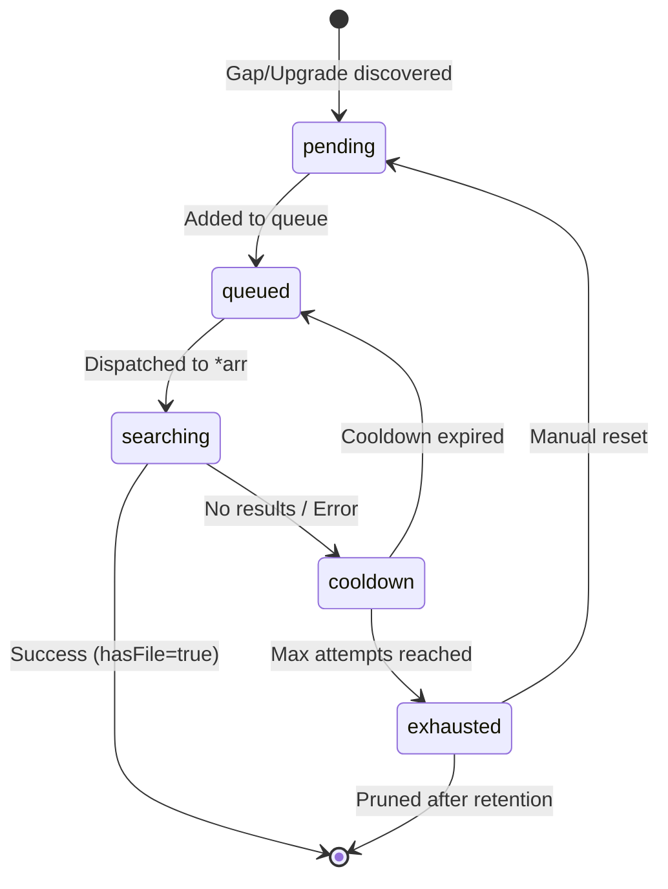
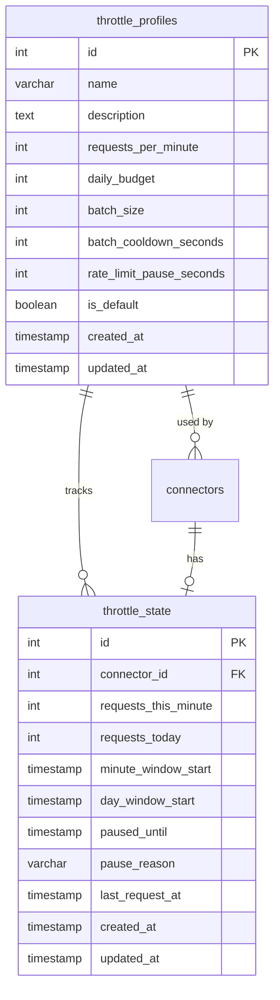
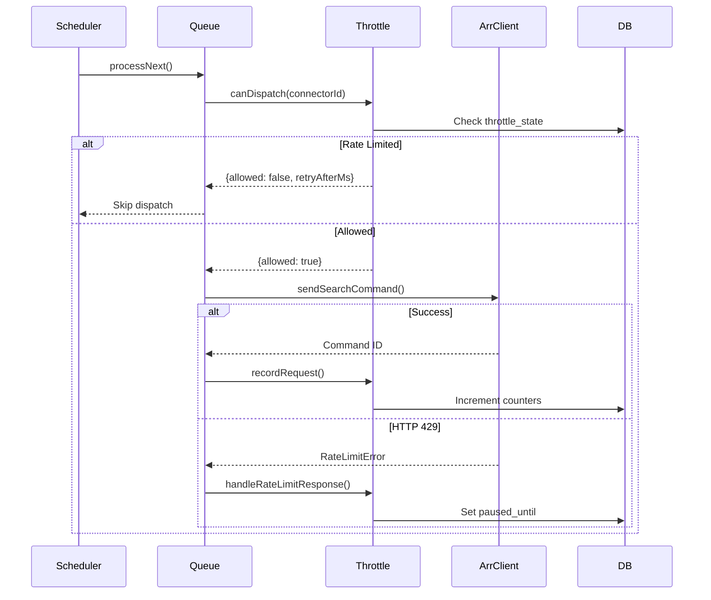
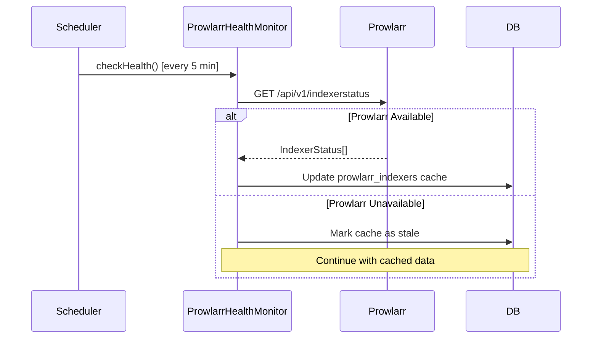
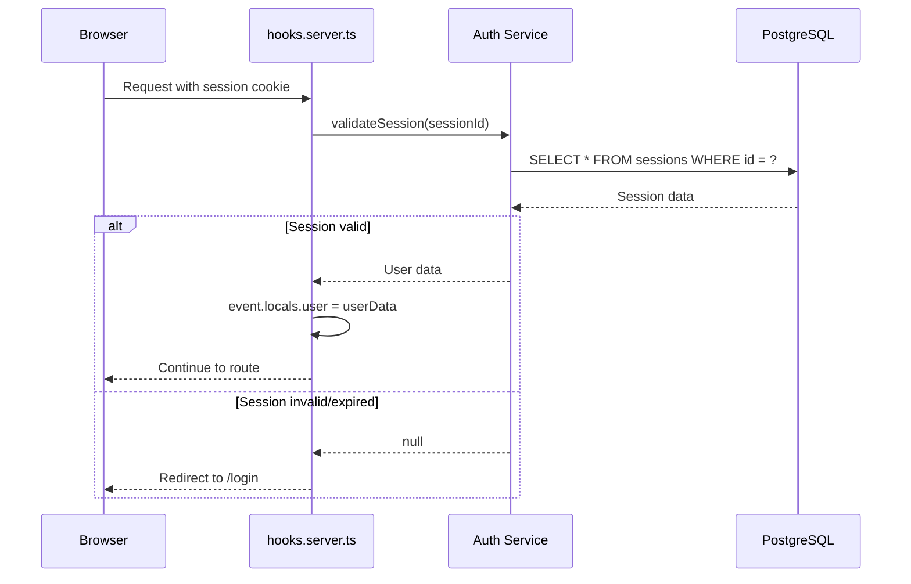

# Design Document: Comradarr

## Overview

Comradarr is a media library completion service built with SvelteKit 2.x, Svelte 5, PostgreSQL, and Bun. It integrates with *arr applications (Sonarr, Radarr, Whisparr) to systematically identify and request missing or upgradeable content. The system maintains all state in its own database, providing clean separation from *arr applications.

### Key Design Decisions

1. **Bun Runtime**: Using Bun for JavaScript runtime and package management provides native PostgreSQL driver support and faster execution
2. **SvelteKit Full-Stack**: Single codebase for frontend and backend with server-side rendering and API routes
3. **Drizzle ORM**: Type-safe database access with schema-driven migrations and TypeScript inference
4. **Content Mirror Pattern**: Local database copy of *arr library state enables efficient gap detection without repeated API calls
5. **Search State Separation**: Tracking Comradarr's actions separately from content state allows rebuilding the mirror without losing operational history

## Architecture



### Request Flow

1. **User Request**: Browser sends request to SvelteKit route
2. **Authentication**: `hooks.server.ts` validates session, populates `event.locals.user`
3. **Load Function**: `+page.server.ts` queries database via Drizzle, returns data
4. **Rendering**: Svelte components render with reactive state
5. **Form Submission**: Actions process mutations, return success/failure

### Background Processing Flow

1. **Scheduler**: Croner triggers sweep cycle at configured interval
2. **Sync**: Fetches library data from *arr application, updates content mirror
3. **Discovery**: Analyzes content mirror for gaps/upgrades, creates search registry entries
4. **Queue**: Prioritizes and batches search requests
5. **Dispatch**: Sends search commands to *arr applications, tracks outcomes

## Components and Interfaces

### Connector Interface

```typescript
// $lib/server/connectors/common/types.ts
interface ArrConnector {
  readonly type: 'sonarr' | 'radarr' | 'whisparr';
  readonly baseUrl: string;
  
  // Health & Status
  ping(): Promise<boolean>;
  getSystemStatus(): Promise<SystemStatus>;
  getHealth(): Promise<HealthCheck[]>;
  
  // Library Data
  getLibrary(options?: PaginationOptions): AsyncIterable<LibraryItem>;
  getWantedMissing(options?: PaginationOptions): AsyncIterable<WantedItem>;
  getWantedCutoff(options?: PaginationOptions): AsyncIterable<WantedItem>;
  
  // Commands
  sendCommand(command: SearchCommand): Promise<CommandResponse>;
  getCommandStatus(commandId: number): Promise<CommandStatus>;
}

interface BaseClientConfig {
  baseUrl: string;
  apiKey: string;
  timeout?: number;
  sslVerify?: boolean;
}

interface PaginationOptions {
  page?: number;
  pageSize?: number;
  sortKey?: string;
  sortDirection?: 'ascending' | 'descending';
}

interface CommandResponse {
  id: number;
  name: string;
  status: 'queued' | 'started' | 'completed' | 'failed';
  queued: string;
  message?: string;
}
```

### Service Interfaces

```typescript
// $lib/server/services/sync/types.ts
interface SyncService {
  incrementalSync(connectorId: number): Promise<SyncResult>;
  fullReconciliation(connectorId: number): Promise<ReconciliationResult>;
  getSyncState(connectorId: number): Promise<SyncState>;
}

interface SyncResult {
  itemsProcessed: number;
  itemsCreated: number;
  itemsUpdated: number;
  itemsDeleted: number;
  duration: number;
  errors: SyncError[];
}

// $lib/server/services/discovery/types.ts
interface DiscoveryService {
  discoverGaps(connectorId: number): Promise<DiscoveryResult>;
  discoverUpgrades(connectorId: number): Promise<DiscoveryResult>;
}

interface DiscoveryResult {
  itemsFound: number;
  itemsQueued: number;
  itemsSkipped: number;
}

// $lib/server/services/queue/types.ts
interface QueueService {
  enqueue(items: QueueItem[]): Promise<void>;
  dequeue(connectorId: number, limit: number): Promise<QueueItem[]>;
  processNext(connectorId: number): Promise<ProcessResult>;
  pause(connectorId?: number): Promise<void>;
  resume(connectorId?: number): Promise<void>;
  clear(connectorId?: number): Promise<number>;
}

interface QueueItem {
  id: number;
  connectorId: number;
  contentType: 'episode' | 'movie';
  contentId: number;
  searchType: 'gap' | 'upgrade';
  priority: number;
  scheduledAt: Date;
  batchId?: string;
}
```

### Database Schema Interfaces

```typescript
// Inferred from Drizzle schema
type Connector = typeof connectors.$inferSelect;
type NewConnector = typeof connectors.$inferInsert;

type Series = typeof series.$inferSelect;
type Episode = typeof episodes.$inferSelect;
type Movie = typeof movies.$inferSelect;

type SearchRegistry = typeof searchRegistry.$inferSelect;
type RequestQueue = typeof requestQueue.$inferSelect;
```

## Data Models

### Database Schema



### Quality Model

```typescript
// Matches *arr API QualityModel structure
interface QualityModel {
  quality: {
    id: number;
    name: string;
    source: string;
    resolution: number;
  };
  revision: {
    version: number;
    real: number;
    isRepack: boolean;
  };
}

// Serialization for database storage
function serializeQuality(quality: QualityModel): string {
  return JSON.stringify(quality);
}

function deserializeQuality(json: string): QualityModel {
  return JSON.parse(json) as QualityModel;
}
```

### Search State Machine



## Throttle Profile System

### Overview

The throttle profile system controls the rate at which Comradarr dispatches search requests to *arr applications. This prevents overwhelming indexers and avoids rate limiting bans.

### Database Schema



### Preset Templates

Throttle profiles are defined as code constants with three presets:

| Preset | Requests/Min | Daily Budget | Batch Size | Cooldown | Rate Limit Pause |
|--------|--------------|--------------|------------|----------|------------------|
| Conservative | 2 | 200 | 5 | 120s | 600s |
| Moderate | 5 | 500 | 10 | 60s | 300s |
| Aggressive | 15 | Unlimited | 10 | 30s | 120s |

### Profile Resolution

```
1. Connector-specific profile (connectors.throttle_profile_id)
   ↓ (if null)
2. Default profile (throttle_profiles.is_default = true)
   ↓ (if not found)
3. Fallback to Moderate preset constants
```

### Throttle Enforcer Service

```typescript
// $lib/server/services/throttle/throttle-enforcer.ts
interface ThrottleResult {
  allowed: boolean;
  reason?: 'rate_limit' | 'daily_budget_exhausted' | 'paused';
  retryAfterMs?: number;
}

class ThrottleEnforcer {
  canDispatch(connectorId: number): Promise<ThrottleResult>;
  recordRequest(connectorId: number): Promise<void>;
  handleRateLimitResponse(connectorId: number, retryAfter?: number): Promise<void>;
  getAvailableCapacity(connectorId: number): Promise<number>;
  resetExpiredWindows(): Promise<void>;
}
```

### Dispatch Flow with Throttling



## Prowlarr Integration (Optional)

### Overview

Prowlarr integration provides optional health monitoring for indexers. Comradarr can query Prowlarr's API to check indexer status before dispatching searches. This is informational only - it does not block dispatches.

### Architecture

Prowlarr is implemented as a utility service, not a connector type:

```
src/lib/server/services/prowlarr/
├── index.ts           # Module exports
├── types.ts           # ProwlarrIndexer, IndexerHealth types
├── client.ts          # ProwlarrClient for API calls
└── health-monitor.ts  # Periodic health checking service
```

### Prowlarr Client

```typescript
// $lib/server/services/prowlarr/client.ts
class ProwlarrClient {
  async getIndexerStatus(): Promise<ProwlarrIndexerStatus[]>;
  async getIndexerStats(): Promise<ProwlarrIndexerStats[]>;
}

interface ProwlarrIndexerStatus {
  id: number;
  indexerId: number;
  disabledTill: Date | null;
  mostRecentFailure: Date | null;
  initialFailure: Date | null;
}
```

### Health Monitoring Flow



### Integration with Queue (Informational)

When Prowlarr is configured and unhealthy indexers are detected:
- Log a warning message
- Display status in UI
- Do NOT block search dispatch (users may have other indexers)


## Error Handling

### Error Categories

```typescript
// $lib/server/connectors/common/errors.ts
abstract class ArrClientError extends Error {
  abstract readonly category: ErrorCategory;
  abstract readonly retryable: boolean;
}

class NetworkError extends ArrClientError {
  readonly category = 'network';
  readonly retryable = true;
  constructor(
    message: string,
    public readonly cause: 'connection_refused' | 'dns_failure' | 'timeout'
  ) {
    super(message);
  }
}

class AuthenticationError extends ArrClientError {
  readonly category = 'authentication';
  readonly retryable = false;
}

class RateLimitError extends ArrClientError {
  readonly category = 'rate_limit';
  readonly retryable = true;
  constructor(public readonly retryAfter?: number) {
    super('Rate limited');
  }
}

class ServerError extends ArrClientError {
  readonly category = 'server';
  readonly retryable = true;
  constructor(public readonly statusCode: number, message: string) {
    super(message);
  }
}

type ErrorCategory = 'network' | 'authentication' | 'rate_limit' | 'server' | 'validation';
```

### Retry Strategy

```typescript
interface RetryConfig {
  maxRetries: number;
  baseDelay: number;
  maxDelay: number;
  backoffMultiplier: number;
}

const defaultRetryConfig: RetryConfig = {
  maxRetries: 3,
  baseDelay: 1000,
  maxDelay: 30000,
  backoffMultiplier: 2,
};

async function withRetry<T>(
  fn: () => Promise<T>,
  config: RetryConfig = defaultRetryConfig
): Promise<T> {
  let lastError: Error;
  let delay = config.baseDelay;
  
  for (let attempt = 0; attempt <= config.maxRetries; attempt++) {
    try {
      return await fn();
    } catch (error) {
      lastError = error as Error;
      
      if (error instanceof ArrClientError && !error.retryable) {
        throw error;
      }
      
      if (attempt < config.maxRetries) {
        await sleep(delay);
        delay = Math.min(delay * config.backoffMultiplier, config.maxDelay);
      }
    }
  }
  
  throw lastError!;
}
```

### Form Action Error Handling

```typescript
// In +page.server.ts
export const actions = {
  addConnector: async ({ request }) => {
    const data = await request.formData();
    const result = v.safeParse(ConnectorSchema, Object.fromEntries(data));
    
    if (!result.success) {
      return fail(400, {
        errors: result.issues.map(i => ({ field: i.path[0], message: i.message }))
      });
    }
    
    try {
      await connectorService.create(result.output);
      return { success: true };
    } catch (error) {
      if (error instanceof AuthenticationError) {
        return fail(401, { error: 'Invalid API key' });
      }
      if (error instanceof NetworkError) {
        return fail(502, { error: 'Could not connect to *arr application' });
      }
      throw error; // Let SvelteKit handle unexpected errors
    }
  }
};
```

## Testing Strategy

### Dual Testing Approach

The testing strategy combines unit tests for specific examples and edge cases with property-based tests for universal correctness properties.

### Unit Testing

Use Vitest for unit tests:

```typescript
// Example: Testing priority calculation
describe('PriorityCalculator', () => {
  it('scores newer content higher than older content', () => {
    const newer = calculatePriority({ airDate: daysAgo(7) });
    const older = calculatePriority({ airDate: daysAgo(365) });
    expect(newer).toBeGreaterThan(older);
  });
  
  it('applies failure penalty correctly', () => {
    const noFailures = calculatePriority({ attemptCount: 0 });
    const withFailures = calculatePriority({ attemptCount: 3 });
    expect(noFailures).toBeGreaterThan(withFailures);
  });
});
```

### Property-Based Testing

Use `fast-check` for property-based tests. Each property test should run a minimum of 100 iterations.

```typescript
import * as fc from 'fast-check';

// Example structure for property tests
describe('Property: Quality serialization round trip', () => {
  it('deserialize(serialize(quality)) equals original quality', () => {
    fc.assert(
      fc.property(qualityModelArbitrary, (quality) => {
        const serialized = serializeQuality(quality);
        const deserialized = deserializeQuality(serialized);
        expect(deserialized).toEqual(quality);
      }),
      { numRuns: 100 }
    );
  });
});
```

### Test Organization

```
src/
├── lib/
│   ├── server/
│   │   ├── connectors/
│   │   │   ├── sonarr/
│   │   │   │   ├── client.ts
│   │   │   │   └── client.test.ts
│   │   │   └── common/
│   │   │       ├── base-client.ts
│   │   │       └── base-client.test.ts
│   │   ├── services/
│   │   │   ├── queue/
│   │   │   │   ├── prioritizer.ts
│   │   │   │   └── prioritizer.test.ts
│   │   │   └── discovery/
│   │   │       ├── gap-detector.ts
│   │   │       └── gap-detector.test.ts
│   │   └── db/
│   │       └── queries/
│   │           ├── content.ts
│   │           └── content.test.ts
│   └── utils/
│       ├── quality.ts
│       └── quality.test.ts
tests/
├── e2e/
│   └── connector-flow.spec.ts
└── properties/
    ├── quality.property.test.ts
    ├── priority.property.test.ts
    └── batching.property.test.ts
```


## Correctness Properties

*A property is a characteristic or behavior that should hold true across all valid executions of a system-essentially, a formal statement about what the system should do. Properties serve as the bridge between human-readable specifications and machine-verifiable correctness guarantees.*

Based on the acceptance criteria analysis, the following correctness properties must be validated through property-based testing:

### Property 1: Quality Model Round Trip

*For any* valid QualityModel object, serializing it to JSON and then deserializing it back should produce an object equal to the original.

This ensures data integrity when storing and retrieving quality information from the database.

**Validates: Requirements 14.4, 14.5**

### Property 2: Gap Discovery Correctness

*For any* content mirror state, the gap discovery function should return exactly the set of items where `monitored = true` AND `hasFile = false`. No monitored missing items should be excluded, and no unmonitored or present items should be included.

**Validates: Requirements 3.1, 3.3**

### Property 3: Upgrade Discovery Correctness

*For any* content mirror state, the upgrade discovery function should return exactly the set of items where `monitored = true` AND `qualityCutoffNotMet = true`. No upgrade candidates should be excluded, and no items at or above cutoff should be included.

**Validates: Requirements 4.1, 4.3**

### Property 4: Search Registry Cleanup on Success

*For any* search registry entry, when the corresponding content item's status changes to successful (hasFile becomes true for gaps, qualityCutoffNotMet becomes false for upgrades), the search registry entry should be deleted.

**Validates: Requirements 3.4, 4.4**

### Property 5: Priority Calculation Determinism

*For any* queue item with fixed attributes (content age, missing duration, user priority, failure count, search type), the priority calculation should always produce the same score. Additionally, newer content should score higher than older content, and items with fewer failures should score higher than items with more failures.

**Validates: Requirements 5.1**

### Property 6: Queue Processing Order

*For any* set of queue items, when processing the queue, items should be dispatched in strictly descending priority order (highest priority first), subject to throttle profile constraints.

**Validates: Requirements 5.2**

### Property 7: Exponential Backoff Calculation

*For any* search failure, the next eligible search time should be calculated using exponential backoff where the delay increases with each attempt. Specifically, delay(n+1) >= delay(n) * backoffMultiplier for all attempts n < maxAttempts.

**Validates: Requirements 5.5**

### Property 8: Exhaustion at Max Attempts

*For any* search registry entry, when the attempt count reaches exactly the configured maximum, the state should transition to "exhausted". The state should not become exhausted before max attempts, and should always become exhausted at max attempts.

**Validates: Requirements 5.6**

### Property 9: Episode Batching Decision

*For any* season with known statistics (total episodes, downloaded episodes, next airing date), the batching decision should follow these rules:
- If season is fully aired (nextAiring is null) AND missing percentage > threshold → SeasonSearch
- If season is currently airing (nextAiring is set) → EpisodeSearch
- If missing count < minimum threshold → EpisodeSearch

**Validates: Requirements 6.1, 6.2, 6.3**

### Property 10: Episode Grouping by Series

*For any* set of episodes to be searched, when batching individual episode searches, all episodes in a batch should belong to the same series. No batch should contain episodes from different series.

**Validates: Requirements 6.4**

### Property 11: Throttle Profile Enforcement

*For any* sequence of search dispatches, the number of requests within any time window should never exceed the throttle profile's requests-per-minute limit, and the total daily requests should never exceed the daily budget.

**Validates: Requirements 7.1, 7.2**

### Property 12: Request Counter Reset

*For any* throttle profile with a configured reset interval, the request counter should reset to zero at the start of each interval. Requests made after reset should not be affected by pre-reset counts.

**Validates: Requirements 7.4**

### Property 13: API Response Parsing Completeness

*For any* valid *arr API response (series, episode, movie, or command), parsing should extract all required fields without data loss. The parsed domain model should contain all information present in the original response that is relevant to the application.

**Validates: Requirements 27.1, 27.2, 27.3, 27.4, 27.5, 27.6**

### Property 14: Parser Robustness to Extra Fields

*For any* valid *arr API response with additional unexpected fields, the parser should successfully extract all required fields and ignore the unknown fields without error.

**Validates: Requirements 27.7**

### Property 15: Parser Graceful Degradation

*For any* malformed *arr API response missing required fields, the parser should skip the malformed record and continue processing remaining records without crashing.

**Validates: Requirements 27.8**

### Property 16: Pagination Completeness

*For any* paginated API response with totalRecords > pageSize, iterating through all pages should yield exactly totalRecords items with no duplicates and no missing items.

**Validates: Requirements 29.2**

### Property 17: Search Command Batch Size Limits

*For any* set of episodes or movies to be searched, when forming search commands, each EpisodeSearch command should contain at most 10 episode IDs, and each MoviesSearch command should contain at most 10 movie IDs.

**Validates: Requirements 29.4, 29.5**

### Property 18: Sync Reconciliation Correctness

*For any* API library response and existing content mirror state, after full reconciliation:
- All items in the API response should exist in the content mirror with matching data
- All items in the content mirror not in the API response should be deleted
- No orphaned search state entries should exist for deleted content

**Validates: Requirements 2.2**

### Property 19: Unhealthy Connector Exclusion

*For any* set of connectors with varying health statuses, sweep cycle scheduling should exclude all connectors with health status "unhealthy" or "offline". Only "healthy" and "degraded" connectors should be included in sweep cycles.

**Validates: Requirements 1.5**

### Property 20: Connector Data Persistence

*For any* valid connector configuration (excluding the API key), after creating a connector and then retrieving it, all non-sensitive fields should match the original input exactly.

**Validates: Requirements 1.1**


## Frontend Architecture

### UI Framework Stack

- **Svelte 5** with Runes reactivity system (`$state`, `$derived`, `$effect`, `$props`)
- **SvelteKit 2.x** with `svelte-adapter-bun` for Bun-native deployments
- **shadcn-svelte** for UI components integrated via `unocss-preset-shadcn`
- **UnoCSS** with `presetWind`, `presetAnimations`, and `presetShadcn` presets
- **Lucide Svelte** for icons with tree-shaking imports

### State Management Patterns

```typescript
// Shared state in .svelte.ts files
// $lib/stores/queue.svelte.ts
class QueueStore {
  items = $state<QueueItem[]>([]);
  isPaused = $state(false);
  
  get pendingCount() {
    return $derived(this.items.filter(i => i.status === 'pending').length);
  }
  
  get processingCount() {
    return $derived(this.items.filter(i => i.status === 'processing').length);
  }
}

export const queueStore = new QueueStore();
```

### Component Patterns

```svelte
<!-- Using $props() with destructuring -->
<script lang="ts">
  import type { Connector } from '$lib/server/db/schema';
  
  let { 
    connector, 
    onEdit, 
    onDelete,
    class: className = '' 
  }: {
    connector: Connector;
    onEdit: (id: number) => void;
    onDelete: (id: number) => void;
    class?: string;
  } = $props();
</script>

<!-- Using snippets instead of slots -->
{#snippet statusBadge(status: string)}
  <span class={`badge badge-${status}`}>{status}</span>
{/snippet}

<div class={className}>
  {@render statusBadge(connector.healthStatus)}
</div>
```

### Component Organization

```
src/lib/components/
├── ui/                       # shadcn-svelte primitives
│   ├── button/
│   ├── card/
│   ├── dialog/
│   └── form/
├── layout/
│   ├── Sidebar.svelte        # Navigation sidebar
│   ├── Header.svelte         # Page header with breadcrumbs
│   └── PageContainer.svelte  # Consistent page wrapper
├── connectors/
│   ├── ConnectorCard.svelte  # Display single connector status
│   ├── ConnectorForm.svelte  # Add/edit connector form
│   └── ConnectorHealth.svelte # Health indicator component
├── content/
│   ├── SeriesCard.svelte     # Series display (Sonarr/Whisparr)
│   ├── MovieCard.svelte      # Movie display (Radarr)
│   ├── EpisodeList.svelte    # Episode listing
│   └── ContentFilters.svelte # Filter controls
├── queue/
│   ├── QueueTable.svelte     # Queue item listing
│   ├── QueueItem.svelte      # Single queue item row
│   └── QueueControls.svelte  # Pause, clear, priority controls
└── shared/
    ├── StatusBadge.svelte    # Reusable status indicator
    ├── ProgressRing.svelte   # Circular progress display
    └── RelativeTime.svelte   # Human-readable timestamps
```

## Notification System Design

### Supported Channels

| Channel | Implementation | Configuration |
|---------|---------------|---------------|
| Discord | Webhook POST | Webhook URL |
| Telegram | Bot API | Bot token, Chat ID |
| Slack | Webhook POST | Webhook URL |
| Pushover | API POST | User key, App token |
| Gotify | API POST | Server URL, App token |
| ntfy | HTTP POST | Topic URL |
| Email | SMTP | Host, port, credentials |
| Webhook | HTTP POST | URL, headers, signature |

### Event Types

```typescript
type NotificationEvent = 
  | { type: 'sweep_started'; connectorId: number; sweepType: 'gap' | 'upgrade' }
  | { type: 'sweep_completed'; connectorId: number; gapsFound: number; itemsQueued: number }
  | { type: 'search_success'; contentTitle: string; quality: string }
  | { type: 'search_exhausted'; contentTitle: string; attempts: number }
  | { type: 'connector_health_changed'; connectorId: number; oldStatus: string; newStatus: string }
  | { type: 'sync_completed'; connectorId: number; itemsProcessed: number }
  | { type: 'sync_failed'; connectorId: number; error: string }
  | { type: 'app_started' }
  | { type: 'update_available'; version: string };
```

### Message Templating

```typescript
interface MessageTemplate {
  title: string;
  body: string;
  // Placeholders: {content_title}, {content_year}, {connector_name}, 
  // {connector_type}, {event_type}, {timestamp}, {statistics}, {url}
}

const defaultTemplates: Record<string, MessageTemplate> = {
  search_success: {
    title: '🎉 Content Found',
    body: '{content_title} ({content_year}) has been grabbed in {quality} quality.'
  },
  sweep_completed: {
    title: '🔍 Sweep Complete',
    body: 'Found {statistics} on {connector_name}.'
  }
};
```

## Scheduler Design

### Croner Configuration

```typescript
// $lib/server/scheduler.ts
import { Cron } from 'croner';

interface ScheduledJob {
  name: string;
  cron: Cron;
  lastRun?: Date;
  nextRun?: Date;
}

const jobs: Map<string, ScheduledJob> = new Map();

export function initializeScheduler() {
  // Incremental sync every 15 minutes
  jobs.set('incremental-sync', {
    name: 'Incremental Sync',
    cron: new Cron('*/15 * * * *', { protect: true }, async () => {
      await syncService.runIncrementalSync();
    })
  });
  
  // Full reconciliation daily at 3 AM
  jobs.set('full-reconciliation', {
    name: 'Full Reconciliation',
    cron: new Cron('0 3 * * *', { protect: true }, async () => {
      await syncService.runFullReconciliation();
    })
  });
  
  // Queue processing every minute
  jobs.set('queue-processor', {
    name: 'Queue Processor',
    cron: new Cron('* * * * *', { protect: true }, async () => {
      await queueService.processNext();
    })
  });
  
  // Health checks every 5 minutes
  jobs.set('health-check', {
    name: 'Health Check',
    cron: new Cron('*/5 * * * *', { protect: true }, async () => {
      await connectorService.checkAllHealth();
    })
  });
  
  // Database maintenance daily at 4 AM
  jobs.set('db-maintenance', {
    name: 'Database Maintenance',
    cron: new Cron('0 4 * * *', { protect: true }, async () => {
      await maintenanceService.runMaintenance();
    })
  });
}
```

## Security Implementation

### Authentication Flow



### API Key Encryption

```typescript
// $lib/server/crypto.ts
import { createCipheriv, createDecipheriv, randomBytes } from 'crypto';

const ALGORITHM = 'aes-256-gcm';
const IV_LENGTH = 16;
const AUTH_TAG_LENGTH = 16;

export function encrypt(plaintext: string, secretKey: string): string {
  const iv = randomBytes(IV_LENGTH);
  const cipher = createCipheriv(ALGORITHM, Buffer.from(secretKey, 'hex'), iv);
  
  let encrypted = cipher.update(plaintext, 'utf8', 'hex');
  encrypted += cipher.final('hex');
  
  const authTag = cipher.getAuthTag();
  
  // Format: iv:authTag:ciphertext
  return `${iv.toString('hex')}:${authTag.toString('hex')}:${encrypted}`;
}

export function decrypt(encrypted: string, secretKey: string): string {
  const [ivHex, authTagHex, ciphertext] = encrypted.split(':');
  
  const iv = Buffer.from(ivHex, 'hex');
  const authTag = Buffer.from(authTagHex, 'hex');
  
  const decipher = createDecipheriv(ALGORITHM, Buffer.from(secretKey, 'hex'), iv);
  decipher.setAuthTag(authTag);
  
  let decrypted = decipher.update(ciphertext, 'hex', 'utf8');
  decrypted += decipher.final('utf8');
  
  return decrypted;
}
```

## Docker Deployment

### Multi-Stage Dockerfile

```dockerfile
# Base stage
FROM oven/bun:1-alpine AS base
WORKDIR /app

# Dependencies stage
FROM base AS deps
COPY package.json bun.lockb ./
RUN --mount=type=cache,target=/root/.bun/install/cache \
    bun install --frozen-lockfile

# Build stage
FROM base AS build
COPY --from=deps /app/node_modules ./node_modules
COPY . .
ENV NODE_ENV=production
RUN bun run build

# Production stage
FROM base AS production
ENV NODE_ENV=production
USER bun
COPY --from=build /app/build ./build
COPY --from=build /app/package.json ./
EXPOSE 3000
HEALTHCHECK --interval=30s --timeout=10s --start-period=5s --retries=3 \
    CMD wget --no-verbose --tries=1 --spider http://localhost:3000/health || exit 1
CMD ["bun", "run", "./build/index.js"]
```

### Docker Compose

```yaml
version: '3.8'
services:
  comradarr:
    build: .
    ports:
      - "3000:3000"
    environment:
      - DATABASE_URL=postgres://comradarr:${DB_PASSWORD}@db:5432/comradarr
      - SECRET_KEY=${SECRET_KEY}
    depends_on:
      db:
        condition: service_healthy
    restart: unless-stopped

  db:
    image: postgres:16-alpine
    volumes:
      - postgres_data:/var/lib/postgresql/data
    environment:
      - POSTGRES_USER=comradarr
      - POSTGRES_PASSWORD_FILE=/run/secrets/db_password
      - POSTGRES_DB=comradarr
    secrets:
      - db_password
    healthcheck:
      test: ["CMD-SHELL", "pg_isready -U comradarr"]
      interval: 10s
      timeout: 5s
      retries: 5

volumes:
  postgres_data:

secrets:
  db_password:
    file: ./secrets/db_password.txt
```

## Logging Architecture

### Structured Logging

```typescript
// $lib/server/logger.ts
interface LogEntry {
  timestamp: string;
  level: 'error' | 'warn' | 'info' | 'debug' | 'trace';
  module: string;
  message: string;
  correlationId?: string;
  [key: string]: unknown;
}

class Logger {
  private module: string;
  
  constructor(module: string) {
    this.module = module;
  }
  
  private log(level: LogEntry['level'], message: string, context?: Record<string, unknown>) {
    const entry: LogEntry = {
      timestamp: new Date().toISOString(),
      level,
      module: this.module,
      message,
      ...context
    };
    
    if (shouldLog(level)) {
      console.log(JSON.stringify(entry));
    }
  }
  
  error(message: string, context?: Record<string, unknown>) {
    this.log('error', message, context);
  }
  
  info(message: string, context?: Record<string, unknown>) {
    this.log('info', message, context);
  }
  
  debug(message: string, context?: Record<string, unknown>) {
    this.log('debug', message, context);
  }
}

export const createLogger = (module: string) => new Logger(module);
```

### Correlation ID Propagation

```typescript
// In hooks.server.ts
import { randomUUID } from 'crypto';

export const handle: Handle = async ({ event, resolve }) => {
  const correlationId = event.request.headers.get('x-correlation-id') || randomUUID();
  
  // Store in locals for access throughout request lifecycle
  event.locals.correlationId = correlationId;
  
  const response = await resolve(event);
  
  // Include in response headers for client-side correlation
  response.headers.set('x-correlation-id', correlationId);
  
  return response;
};
```


## TypeScript Configuration

### Strict TypeScript Settings

```json
// tsconfig.json
{
  "extends": "./.svelte-kit/tsconfig.json",
  "compilerOptions": {
    "strict": true,
    "noUncheckedIndexedAccess": true,
    "exactOptionalPropertyTypes": true,
    "noImplicitOverride": true,
    "verbatimModuleSyntax": true
  }
}
```

## Drizzle Configuration

### Schema and Migration Setup

```typescript
// drizzle.config.ts
import 'dotenv/config';
import { defineConfig } from 'drizzle-kit';

export default defineConfig({
  out: './drizzle',
  schema: './src/lib/server/db/schema.ts',
  dialect: 'postgresql',
  dbCredentials: {
    url: process.env.DATABASE_URL!
  },
  migrations: {
    prefix: 'timestamp',
    table: '__drizzle_migrations__'
  },
  strict: true,
  verbose: true
});
```

### Database Client with Bun Native Driver

```typescript
// src/lib/server/db/index.ts
import { SQL } from 'bun';
import { drizzle } from 'drizzle-orm/bun-sql';
import * as schema from './schema';

const client = new SQL({
  url: process.env.DATABASE_URL!,
  max: 20,                    // Pool size
  idleTimeout: 30,            // Close idle after 30s
  maxLifetime: 60 * 30,       // Recycle connections after 30min
  connectionTimeout: 30,      // Acquisition timeout
});

export const db = drizzle({ client, schema });
```

### Prepared Statements for Frequent Queries

```typescript
// src/lib/server/db/queries/content.ts
import { sql, eq } from 'drizzle-orm';
import { db } from '../index';
import { episodes, movies } from '../schema';

// Prepare once at module level
export const getEpisodeById = db
  .select()
  .from(episodes)
  .where(eq(episodes.id, sql.placeholder('id')))
  .prepare('get_episode_by_id');

export const getMissingEpisodes = db
  .select()
  .from(episodes)
  .where(eq(episodes.hasFile, false))
  .where(eq(episodes.monitored, true))
  .where(eq(episodes.connectorId, sql.placeholder('connectorId')))
  .prepare('get_missing_episodes');
```

## Validation with Valibot

### Schema Definitions

```typescript
// src/lib/schemas/connector.ts
import * as v from 'valibot';

export const ConnectorSchema = v.object({
  name: v.pipe(v.string(), v.minLength(1), v.maxLength(100)),
  type: v.picklist(['sonarr', 'radarr', 'whisparr']),
  url: v.pipe(v.string(), v.url()),
  apiKey: v.pipe(v.string(), v.minLength(32)),
  enabled: v.optional(v.boolean(), true),
  sslVerify: v.optional(v.boolean(), true),
  timeout: v.optional(v.pipe(v.number(), v.minValue(5), v.maxValue(120)), 30)
});

export type ConnectorInput = v.InferInput<typeof ConnectorSchema>;
export type ConnectorOutput = v.InferOutput<typeof ConnectorSchema>;

export const ThrottleProfileSchema = v.object({
  name: v.pipe(v.string(), v.minLength(1), v.maxLength(50)),
  requestsPerMinute: v.pipe(v.number(), v.minValue(1), v.maxValue(60)),
  batchSize: v.pipe(v.number(), v.minValue(1), v.maxValue(50)),
  cooldownSeconds: v.pipe(v.number(), v.minValue(60), v.maxValue(86400)),
  dailyBudget: v.pipe(v.number(), v.minValue(10), v.maxValue(10000)),
  backoffMultiplier: v.pipe(v.number(), v.minValue(1.5), v.maxValue(3))
});
```

### Form Integration with Superforms

```svelte
<!-- src/routes/(app)/connectors/+page.svelte -->
<script lang="ts">
  import * as Form from '$lib/components/ui/form';
  import { Input } from '$lib/components/ui/input';
  import { Select } from '$lib/components/ui/select';
  import { superForm } from 'sveltekit-superforms';
  import { valibot } from 'sveltekit-superforms/adapters';
  import { ConnectorSchema } from '$lib/schemas/connector';
  import type { PageProps } from './$types';

  let { data }: PageProps = $props();
  
  const form = superForm(data.form, {
    validators: valibot(ConnectorSchema),
    resetForm: true,
    onResult: ({ result }) => {
      if (result.type === 'success') {
        // Handle success (e.g., show toast, refresh list)
      }
    }
  });
  
  const { form: formData, enhance, errors, submitting } = form;
</script>

<form method="POST" action="?/create" use:enhance>
  <Form.Field {form} name="name">
    <Form.Control>
      {#snippet children({ props })}
        <Form.Label>Name</Form.Label>
        <Input {...props} bind:value={$formData.name} placeholder="My Sonarr" />
      {/snippet}
    </Form.Control>
    <Form.Description>A friendly name for this connector</Form.Description>
    <Form.FieldErrors />
  </Form.Field>

  <Form.Field {form} name="type">
    <Form.Control>
      {#snippet children({ props })}
        <Form.Label>Type</Form.Label>
        <Select {...props} bind:value={$formData.type}>
          <option value="sonarr">Sonarr</option>
          <option value="radarr">Radarr</option>
          <option value="whisparr">Whisparr</option>
        </Select>
      {/snippet}
    </Form.Control>
    <Form.FieldErrors />
  </Form.Field>

  <Form.Field {form} name="url">
    <Form.Control>
      {#snippet children({ props })}
        <Form.Label>URL</Form.Label>
        <Input {...props} bind:value={$formData.url} placeholder="http://localhost:8989" />
      {/snippet}
    </Form.Control>
    <Form.FieldErrors />
  </Form.Field>

  <Form.Field {form} name="apiKey">
    <Form.Control>
      {#snippet children({ props })}
        <Form.Label>API Key</Form.Label>
        <Input {...props} type="password" bind:value={$formData.apiKey} />
      {/snippet}
    </Form.Control>
    <Form.Description>Found in Settings → General → Security</Form.Description>
    <Form.FieldErrors />
  </Form.Field>

  <Form.Button disabled={$submitting}>
    {$submitting ? 'Testing...' : 'Add Connector'}
  </Form.Button>
</form>
```

## UnoCSS Configuration

```typescript
// uno.config.ts
import { presetWind } from '@unocss/preset-wind3';
import { defineConfig, presetAttributify } from 'unocss';
import presetAnimations from 'unocss-preset-animations';
import { presetShadcn } from 'unocss-preset-shadcn';

export default defineConfig({
  presets: [
    presetWind(),
    presetAttributify({ prefix: 'un-' }),
    presetAnimations(),
    presetShadcn({ color: 'slate' })
  ],
  shortcuts: {
    // Buttons
    'btn': 'py-2 px-4 font-semibold rounded-lg shadow-md transition-colors',
    'btn-primary': 'btn bg-primary text-primary-foreground hover:bg-primary/90',
    'btn-secondary': 'btn bg-secondary text-secondary-foreground hover:bg-secondary/80',
    'btn-destructive': 'btn bg-destructive text-destructive-foreground hover:bg-destructive/90',
    
    // Cards
    'card-base': 'rounded-lg border bg-card text-card-foreground shadow-sm',
    
    // Status indicators
    'status-healthy': 'bg-green-500 text-white',
    'status-degraded': 'bg-yellow-500 text-black',
    'status-unhealthy': 'bg-red-500 text-white',
    'status-offline': 'bg-gray-500 text-white',
    
    // Layout
    'page-container': 'container mx-auto p-4 md:p-6',
    'sidebar-item': 'flex items-center gap-2 px-3 py-2 rounded-md hover:bg-accent transition-colors'
  }
});
```

## SvelteKit Adapter Configuration

```javascript
// svelte.config.js
import adapter from 'svelte-adapter-bun';
import { vitePreprocess } from '@sveltejs/vite-plugin-svelte';

/** @type {import('@sveltejs/kit').Config} */
const config = {
  preprocess: vitePreprocess(),
  kit: {
    adapter: adapter({
      out: 'build',
      precompress: true,
      envPrefix: ''
    }),
    alias: {
      $components: 'src/lib/components',
      $server: 'src/lib/server'
    }
  }
};

export default config;
```

